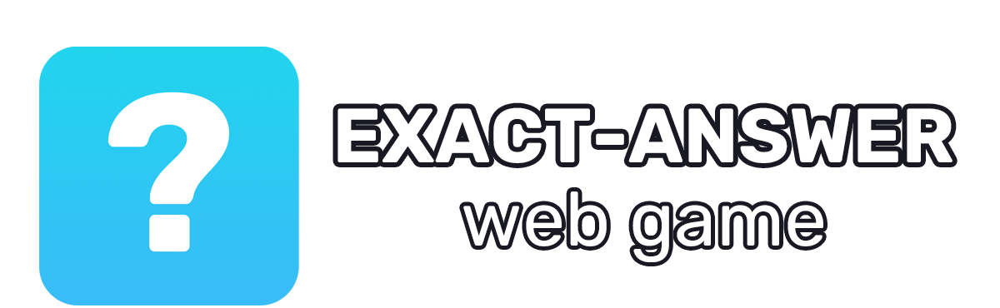

<p align="center">
  <a href="https://github.com/x4r3s/exact-answer">
    
  </a>
</p>

<p align="center">
  <a href="https://github.com/x4r3s/exact-answer">
    
  </a>
  <a href="https://github.com/x4r3s/exact-answer/blob/main/LICENSE">
    
  </a>
</p>

<p align="center">
  <a href="https://developer.mozilla.org/en-US/docs/Web/HTML">
    
  </a>
  <a href="https://developer.mozilla.org/en-US/docs/Web/CSS">
    
  </a>
  <a href="https://developer.mozilla.org/en-US/docs/Web/JavaScript">
    
  </a>
</p>

---

## 📌 About

**EXACT ANSWER** is a lightweight browser-based riddle game where the player must type the **exact answer** for each question.

The project is intentionally built using **vanilla web technologies** to demonstrate clean structure, readable game logic, and responsive layout without frameworks or external libraries.

---

## ✨ Features

- Minimalistic and intuitive user interface
- Fully responsive layout
- No external dependencies
- Clear separation of structure, style, and logic
- Hint system after wrong attempts
- Protection against repeated submit race conditions

---

## 🎮 Gameplay

- The game contains **10 riddles**
- Each riddle gives the player **3 attempts**
- Answers are checked by exact string match (normalized to lowercase)
- After each wrong answer, a contextual hint is shown
- If attempts reach zero, the game reveals the correct answer and moves to the next riddle
- The final screen appears after all riddles are completed

---

## 🛠 Technologies

| Technology | Description |
|-----------|-------------|
| HTML5 | Page structure and semantics |
| CSS3 | Styling and responsive layout |
| JavaScript | Game logic and interactivity |

---

## 🌍 Browser Support

**EXACT ANSWER** works in all modern browsers:

- ✅ Google Chrome (latest)
- ✅ Mozilla Firefox (latest)
- ✅ Microsoft Edge (latest)
- ✅ Safari (latest)

> JavaScript must be enabled.

---

## 📁 Project Structure

```text
exact-answer/
├── index.html      # Main HTML file, game layout and structure
├── style.css       # Stylesheet for layout, colors, and responsiveness
├── script.js       # Game logic and user interaction
├── banner.png      # Project banner image (used in README)
├── github.svg      # GitHub icon used in footer
├── favicon.png     # Browser tab icon
└── LICENSE         # Project license
```

---

## 🚀 Getting Started

You can run the game locally in a few simple steps.

### 1. Clone the repository

```bash
git clone https://github.com/x4r3s/exact-answer.git
```

### 2. Open the project folder

```bash
cd exact-answer
```

### 3. Run the game

Open `index.html` directly in your browser.